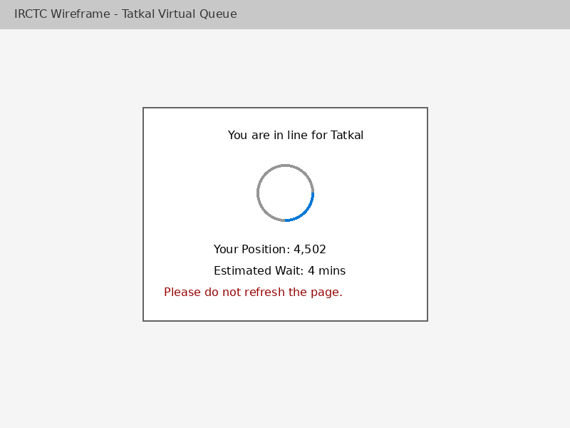
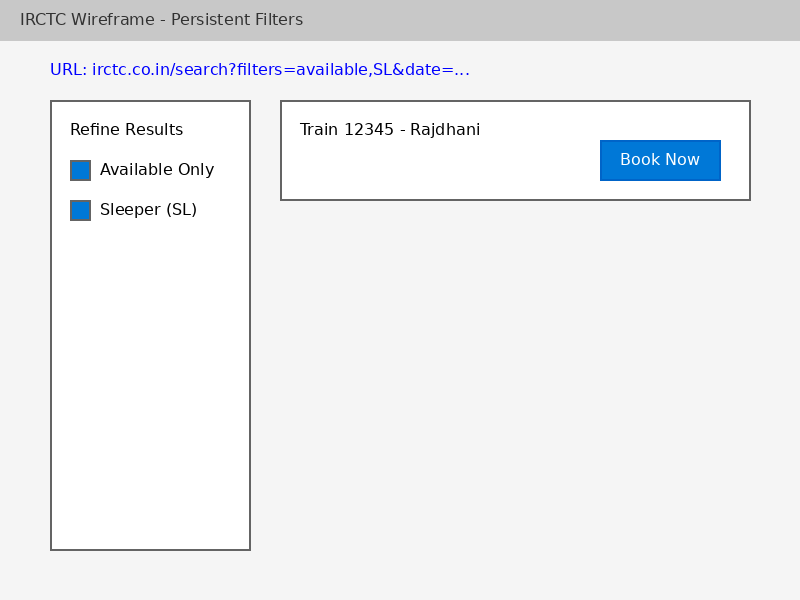
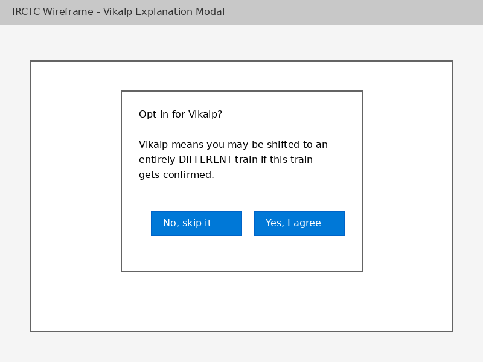
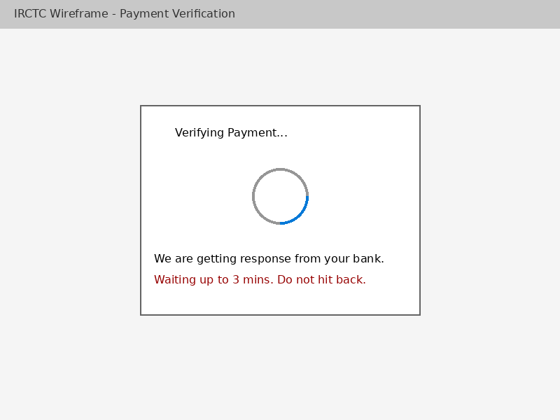

## Feature Spec 1: Virtual Queueing for Tatkal Surge
 
### Problem Statement
Daily at 10:00 AM and 11:00 AM, the IRCTC system faces a massive surge of concurrent users trying to book Tatkal tickets, causing the backend to crash. Users experience endless spinners, timeouts, and abrupt session expiries without any status feedback. This affects millions of users depending on the high-demand tickets who are forced into a blind race.
 
### Current State (from Part A)
At Step 7 of the flow, after clicking "Book Now," users encounter an endless loading spinner. Without backend throttling, the server connections are exhausted. The user's session is ultimately dropped, abruptly redirecting them to the login page or a white screen instead of processing their booking request.
 
### Proposed Solution
Implement a "Virtual Queue" system for Tatkal timings. When users hit "Search Trains" or "Book Now" during peak Tatkal hours, they instantly enter a WebSocket-based or polling queue. The UI displays their exact position in line and an estimated wait time. Their session is kept alive automatically while in the queue. Only a manageable number of users are let through to the booking gateway per second, completely eliminating 503 Service Unavailable errors.
 
### Proposed User Flow — Step by Step
1. User logs in at 9:55 AM and selects source, destination, and Tatkal quota.
2. User clicks "Book Now" at exactly 10:00 AM.
3. **[NEW]** UI immediately transitions to a "Queue Room" page.
4. **[NEW]** User sees "Your Position: X" and "Estimated Wait: Y mins".
5. **[NEW]** As the queue progresses, the numbers dynamically count down.
6. **[NEW]** When it is their turn, the user is automatically forwarded to the Passenger Details form.
7. User fills details and proceeds securely without any system timeout.
 
### Technical Implementation Plan
**System components affected:**
- Frontend Booking routing module.
- API API Gateway / Load Balancer.
- Session Management Service.
 
**New data requirements:**
- In-memory data store (Redis/Memcached) setup for fast queuing/dequeuing of user session tokens.
 
**API changes:**
- `POST /api/queue/join` - assigns a queue ID to the user.
- `GET /api/queue/status` - long-polling endpoint to check position.
 
**Frontend changes:**
- New `QueueRoom` component overlay.
- Heartbeat mechanism to keep session active while waiting.
 
**Third-party services (if any):**
- AWS SQS or Redis cluster specifically for high-throughput queuing.
 
### Success Metrics
- 99% reduction of HTTP 503/504 errors on booking endpoints at 10 AM.
- Drop in user rage clicks or forced reloads by 80%.
- Positive user sentiment increase regarding Tatkal predictability.
 
### Edge Cases and Constraints
- User closes tab while in queue: Allow a 60-second grace period for them to reconnect and reclaim their spot.
- Queue service goes down: Degraded mode fails open to a randomized lottery queue to avoid complete outage.
- IRCTC's legacy DB locks during high writes regardless of queue.
 
### Wireframe

*Caption: Proposed Tatkal virtual queue screen showing progress*

---
 
## Feature Spec 2: Persistent Filter States via URL
 
### Problem Statement
Applying search filters (Train Class, Available only) does not reliably persist if the user navigates to a train's passenger details page and then hits the "Back" button. This forces users to repeatedly re-apply their filters, wasting time and risking expired inventory.
 
### Current State (from Part A)
In Step 7, after clicking "Back" from the booking page, the user is returned to a clean slate search results page. The client-side filter state is completely reset because it is only held in temporary React/Angular local component state.
 
### Proposed Solution
Bind the search filter state strictly to URL Query Parameters. As the user selects filters, the URL dynamically updates (e.g., `?filters=available,SL`). When the user clicks "Back," the browser organically reloads the URL containing the params, and the search module initializes by reading the parameters and hydrating the filter UI accordingly.
 
### Proposed User Flow — Step by Step
1. User searches for trains NDLS to BCT for a future date.
2. User clicks "Available" and "Sleeper (SL)".
3. **[NEW]** The URL changes to `irctc.co.in/search?filters=avl,SL`.
4. User clicks "Book Now" and is taken to the passenger form.
5. User clicks "Back".
6. **[NEW]** URL restores to `irctc.co.in/search?filters=avl,SL`. The page instantly reads the URL, checks the filter boxes, and filters the list locally without a new API search.
 
### Technical Implementation Plan
**System components affected:**
- Frontend Search Results Component.
- Frontend App Router.
 
**New data requirements:**
- None.
 
**API changes:**
- None.
 
**Frontend changes:**
- Sync state manager (Redux/Context) to listen to `window.location.search`.
- Implement `history.pushState` on filter clicks to prevent full page reloads while updating the URL.
 
**Third-party services (if any):**
- Standard router libraries (React Router / Vue Router).
 
### Success Metrics
- 100% filter retention on browser Back navigation.
- Reduction in redundant backend calls for search results since results can be cached and re-filtered client-side.
 
### Edge Cases and Constraints
- Manually tampered URLs with invalid filters: Silently ignore invalid filter strings and load defaults.
- URLs become overly long: Compress params (e.g., `&c=SL,3A&a=1`).
 
### Wireframe

*Caption: Filter state reflected in the browser URL and UI sidebar*

---

## Feature Spec 3: Strict Seat Selection Data Binding
 
### Problem Statement
When selecting a preferred berth (e.g., Lower Berth) during passenger details, the selection silently resets or gets un-bound if the generic DOM re-renders (like adding a second passenger row). Senior citizens specifically lose their preference requests without noticing until the final confirmation page.
 
### Current State (from Part A)
Around Step 5 to Step 7, the DOM dynamically adds a new passenger input row. Because the berth preference selector is not strictly bound to the overarching form state payload, the re-render clears the dropdown's value or drops it from the submission payload.
 
### Proposed Solution
Implement centralized form state management (e.g., Formik or React Hook Form) where every passenger row corresponds strictly to an array index in a central object. Input fields become fully controlled components, guaranteeing the visual dropdown value is exactly what gets summarized on checkout. Show a warning if preferences are left empty for senior citizens.
 
### Proposed User Flow — Step by Step
1. User selects train and reaches "Passenger Details".
2. User enters details and selects "Lower" from Berth Preference.
3. User adds a second passenger.
4. **[NEW]** First passenger's row collapses securely holding the "Lower Berth" state. The form state persists.
5. User clicks "Proceed".
6. **[NEW]** Confirmation screen correctly displays "Berth Preference: Lower".
 
### Technical Implementation Plan
**System components affected:**
- Frontend Passenger Details Form.
 
**New data requirements:**
- None.
 
**API changes:**
- None (Payload structure remains the same, but values will be accurate).
 
**Frontend changes:**
- Refactor the form array (`passengers[]`) to utilize controlled inputs explicitly tied to state.
 
**Third-party services (if any):**
- UI Validation libraries (e.g., Yup, Zod).
 
### Success Metrics
- Drop the "Unintended Berth Allocation" complaint rate by >90%.
- Reduce form abandonment and "Back" clicks from the Review page.
 
### Edge Cases and Constraints
- User selects Lower berth but is under 45 years old or not senior quota.
- User accidentally modifies a passenger after it's saved.

---

## Feature Spec 4: Fallback Audio CAPTCHA & Resilience
 
### Problem Statement
During login or checkout, the dynamic alphanumeric image CAPTCHA often fails to load due to 500 errors. The user is trapped because the form requires CAPTCHA validation. Clicking the manual refresh button often does nothing, forcing a hard page reload.
 
### Current State (from Part A)
In Step 3 and 5, the image tag `src="/eticketing/captcha"` times out. The user clicks refresh, but the client does not capture the error or implement a retry backoff, permanently bricking the form validation logic.
 
### Proposed Solution
Implement a resilient CAPTCHA component that automatically retries fetching the image if the `onerror` event fires (up to 3 times with exponential backoff). If it completely fails, fallback to an Audio CAPTCHA endpoint or seamlessly downgrade to an alternative verification method (like a temporary hidden token logic under low-load).
 
### Proposed User Flow — Step by Step
1. User opens the login modal.
2. **[NEW]** CAPTCHA image attempts to load. If it encounters a 500 Network error, the component instantly tries a secondary image generation node.
3. **[NEW]** A small "Audio instead" button is visibly available.
4. User types the text and proceeds successfully.
5. If the user clicks "Refresh", a loading spinner appears specifically inside the CAPTCHA box to indicate fetching.
 
### Technical Implementation Plan
**System components affected:**
- Frontend Login / Auth Modals.
- API CAPTCHA generation service.
 
**New data requirements:**
- None.
 
**API changes:**
- Introduce a dedicated, low-latency microservice for CAPTCHA generation isolated from main database bottlenecks.
- `GET /captcha/audio` endpoint.
 
**Frontend changes:**
- Catch ` onerror` events.
- Implement exponential backoff retry.
 
**Third-party services (if any):**
- Consider replacing in-house CAPTCHA with Cloudflare Turnstile or ReCAPTCHA v3 (invisible) to dramatically reduce friction.
 
### Success Metrics
- Form completion rate increases by 15% during morning hours.
- Mean Time to Login drops significantly.
 
### Edge Cases and Constraints
- Cloudflare Turnstile blocks legitimate users on VPNs.
- Audio CAPTCHA might not play on mobile browsers blocking auto-play audio.
 
---

## Feature Spec 5: "Vikalp" Explicit Consent Modal
 
### Problem Statement
The "Opt-in for Vikalp" feature uses an ambiguous inline checkbox. Users check it hoping to get a confirmed seat on their current train but are unknowingly agreeing to be shifted to entirely different trains, leading to ruined itineraries and anger.
 
### Current State (from Part A)
At Step 4, the user checks an inconspicuous box under "Other Preferences" that lacks a tooltip or explanation. They proceed to booking without realizing the drastic terms agreed upon.
 
### Proposed Solution
Convert "Vikalp" from a simple inline checkbox into an explicit, progressive disclosure action. If the user toggles it on, an immediate Modal pops up explaining in plain language: "You may be shifted to a different train on the same day." The user must click an explicit "I Understand and Agree" button inside the modal to activate the toggle.
 
### Proposed User Flow — Step by Step
1. User fills passenger details for a Waitlisted ticket.
2. User clicks the "Opt for Vikalp" toggle.
3. **[NEW]** A modal immediately pops up.
4. **[NEW]** Modal text clearly states: "Vikalp means you agree to be shifted to a **different train** going to your destination if this one doesn't confirm."
5. **[NEW]** User explicitly clicks "Yes, I agree" or "Cancel".
6. Form safely records the fully informed consent.
 
### Technical Implementation Plan
**System components affected:**
- Frontend Passenger Details UI.
 
**New data requirements:**
- Explicit consent flag (Already exists, just modifying the UX).
 
**API changes:**
- None.
 
**Frontend changes:**
- Implement `<Dialog>` modal component attached to the toggle's `onChange` event listener.
 
**Third-party services (if any):**
- None.
 
### Success Metrics
- 50% decrease in TDRs/Refunds filed specifically under "Wrong Train via Vikalp".
- Reduction in customer support complaints regarding Vikalp.
 
### Edge Cases and Constraints
- Avoid interrupting power-users every time: Maybe store a `has_agreed_to_vikalp_before` flag in `localStorage` to bypass the modal for frequent bookers.
 
### Wireframe

*Caption: Vikalp opt-in requires explicit consent via an interruptive modal*

---

## Feature Spec 6: Payment Webhook Polling & Graceful Recovery
 
### Problem Statement
If a bank gateway is slow to respond, the IRCTC 3-minute session expires while the user is away. The user is redirected back to a generic "Session Expired" error, unaware if the booking succeeded, while the bank deducts the money.
 
### Current State (from Part A)
At Step 6, the redirect lands on the client. Because the session cookie died 5 seconds ago, the client forcibly logs the user out. The ticket might be generated asynchronously on the backend, but the frontend is broken.
 
### Proposed Solution
Transition from synchronous session reliance to an asynchronous Webhook & Polling model. When the user returns from the payment gateway (even if the main auth token expired), the "Return URL" contains an encrypted transaction token. The frontend uses this specific token to poll an unauthenticated "Txn Status" endpoint for up to 5 minutes, displaying a clear "Verifying Payment" UI until the backend confirms the ticket or issues a refund.
 
### Proposed User Flow — Step by Step
1. User proceeds to Net Banking.
2. User pays. Bank processes it slowly.
3. User is redirected back to IRCTC. Authorisation Session has died.
4. **[NEW]** The URL is `irctc.co.in/payment/verify?txnId=XYZ`. 
5. **[NEW]** Frontend displays "Verifying Payment with your Bank..." showing a polling animation.
6. **[NEW]** Backend webhook receives bank confirmation. Frontend polling receives `{status: "SUCCESS"}`.
7. **[NEW]** Frontend displays the Ticket Details page safely, even if logged out of main features.
 
### Technical Implementation Plan
**System components affected:**
- Payment Gateway Integrations (PGs).
- API Booking Confirmation logic.
- Frontend App Router and Auth guard.
 
**New data requirements:**
- Temporary URL Txn token store in DB tied to gateway TXN ID.
 
**API changes:**
- `GET /api/public/txn/status?tokenXYZ` - limited endpoint to check status without needing global Auth session.
 
**Frontend changes:**
- Exempt `/payment/verify` routes from the strict `RequireAuth` guard if `txnId` is present.
- Implement polling interval (every 5 seconds).
 
**Third-party services (if any):**
- PG Server-to-Server callbacks (Webhooks).
 
### Success Metrics
- Over 95% of slow transactions correctly resolve to a "Success" or "Failed" UI rather than generic session expiry.
- Dramatic reduction in "Money cut, no ticket" customer support tickets.
 
### Edge Cases and Constraints
- Txn polling limit: Stop polling after 10 minutes and show a "Pending Verification - Check Email Later" screen.
- Security: Make sure the `txnId` is a high-entropy cryptographically secure token so external users cannot brute force ticket data.
 
### Wireframe

*Caption: Payment polling screen independent of normal session auth*
